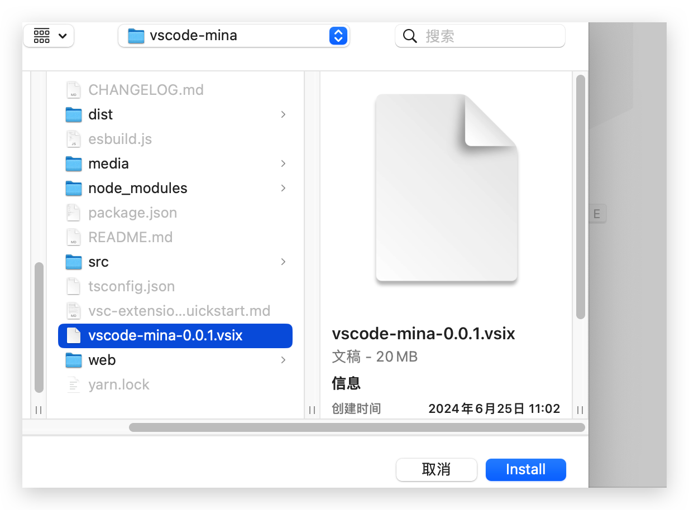

## Tutorial on Using vscode-mina

### Installing Extension

Open the Extension panel and click `Install from VSIX` 

Select the.vsix extension and click Install: 

When you see the following interface, it means the installation is successful: 

### 使用教程

Click `Config` to configure account information.

Click `Compile` to compile the contract.

Click `Deploy` to deploy the contract. 